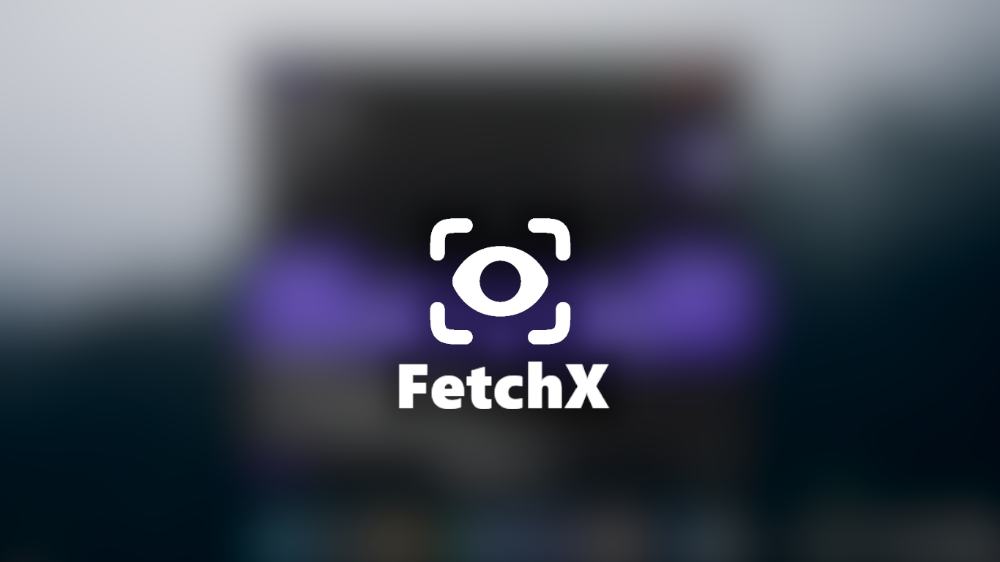

#  FetchX

**A simple, open-source auto image processing tool for you :3**

[](https://wyv9.github.io/fetchx)
[](https://github.com/wyv9/fetchx/releases/latest/download/FetchX.exe)
[](https://github.com/wyv9/fetchx/releases)
[](https://github.com/wyv9/fetchx/blob/main/LICENSE)




---

## ✨ Features
- **Multi-format Support:** PNG, JPG, WebP, BMP, TIFF  
- **Custom Resolution Output:** *E.g.* Stretch 800×600 to 1366×768  
- **Real-time Processing:** Watch folders and process instantly  
- **Concurrent Tasks:** Run multiple watchers simultaneously  
- **Modern UI:** Beautiful, transparent PyQt6 interface  
- **Startup Automation:** Option to auto-run on Windows startup  
- **Live Logging:** Monitor every action in real time  
- **Config Export:** Save and restore task configurations  
- **Lightweight:** Wont fry your CPU  

---

## 📂 How to Use

### 👥 For Users
1. Download the [latest release](https://github.com/wyv9/fetchx/releases).  
2. Run `FetchX.exe`.  
3. Enjoy <3  

> [!TIP]
> If it ever stops working while you’re playing a game, set the `.exe` to **Run as Administrator**.
>  
> The app will create a config file — keep both in the same folder and optionally make a app shortcut for easy access.

---

### ⚙️ Build It Yourself
```bash
git clone https://github.com/wyv9/fetchx.git
cd fetchx
pip install -r requirements.txt
```

#### 📦 To build the executable:
```bash
pyinstaller --onefile --noconsole --add-data "assets;assets" FetchX_1.0.py --version-file v.txt --icon "src/assets/icon.ico"
```

---

## 📜 License

This project is licensed under the MIT License


<div align="center">

Made with love by wyv <3

</div>
